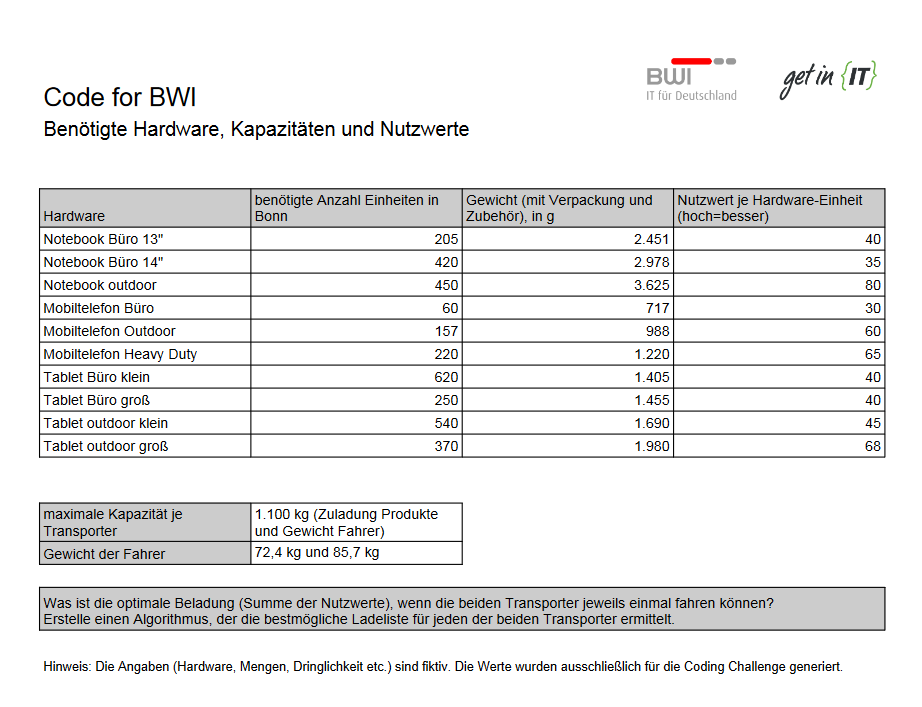

# CODE-FOR-BWI - Christopher Mogler
## Aufgabe
Die Nutzer in Bonn benötigen die verschiedenen Notebooks, Telefone und Tabletts mit unterschiedlicher Dringlichkeit. Daher ist für jeden Gerätetyp ein Nutzwert ermittelt worden. Ziel ist es, mit der Auslieferung der ersten Fahrt einen möglichst hohen kumulierten Nutzen zu erzielen.

 Für die Fahrt an den Bonner Standort stehen Dir 2 Transporter zur Verfügung. Entwickle einen Algorithmus, um die beiden Transporter optimal für die erste (einmalige) Fahrt zu beladen. Beachte hierbei die Ladekapazität der Transporter sowie die unterschiedlichen Gewichte der Hardware und den Bedarf am Standort Bonn. Ergebnis soll eine optimale Ladeliste sein. 



## How-To

### Software

Folgende Software wird benötigt:

- NodeJS (https://nodejs.org/en/download/current/)
- NPM (wird von NodeJS mit bereitgestellt)
- *GIT (https://git-scm.com/downloads)* 
- Irgend einen Browser

### Source-Code

Sie können den Source-Code auf zwei Arten herunterladen:

1. Verwendung von GIT
   ```git clone https://github.com/mogler-dev/code-for-bwi_mogler.git ```
2. Direct-Download-Link (https://github.com/mogler-dev/code-for-bwi_mogler/archive/main.zip)

### NodeJS und NPM

Öffnen Sie das Terminal / CMD und ändern Sie den Ordner mit dem Source-Code (nicht ./src/ !!).
Führen Sie danach den Befehl ```npm install``` aus, um die benötigten Packages von NPM herunterzuladen (dies kann einige Minuten dauern).
Jetzt sollte sich ein Ordner "./node_modules/" erstellt haben. 

Nun führen Sie diesen Befehl aus ```npm run start```
Sie sollten in der Konsole diesen Befehl erhalten: "Server is now listening  :: : 3000"
Bitte beachten Sie, dass der Port 3000 nicht von einem anderen Programm besetzt sein darf.

Öffnen Sie bitte Ihren Browser (Firefox, Chrome, Opera, Safari, neuer Edge) unter diesem Link http://localhost:3000
Jetzt sollten Sie zwei Tabellen sehen, die erste mit den Hardwareliste und die zweite mit der eigentlichen Lösung.

## Dokumentation 

### Algorithmus 

Der Algorithmus Summiert die Nutzwerte der jeweils einzelnen Objekte und läuft rekrusive durch bis zum letzten Objekt, zieht dabei die selektierten Objekte vom Variablen Container ab. Die Liste wird sortiert nach der Summe der Nutzwerte (Nutzwert mal Menge), dabei absteigend nach der Größe (größtes als erstes). 

---------------------

## LICENSE
 Copyright &copy; 2021 Christopher Rudolf Karl-Heinz Mogler

 This program is free software: you can redistribute it and/or modify
 it under the terms of the GNU General Public License as published by
 the Free Software Foundation, either version 3 of the License, or
 (at your option) any later version.

 This program is distributed in the hope that it will be useful,
 but WITHOUT ANY WARRANTY; without even the implied warranty of
 MERCHANTABILITY or FITNESS FOR A PARTICULAR PURPOSE.  See the
 GNU General Public License for more details.

 You should have received a copy of the GNU General Public License
 along with this program.  If not, see <https://www.gnu.org/licenses/>.

## Quellen

### code_for_bwi.pdf  (code_for_bwi.jpg) &copy; 2021 get in GmbH

https://www.get-in-it.de/coding-challenge#mitmachen
https://www.get-in-it.de/imgs/it/codingCompetition/bwi/code_for_bwi.pdf

